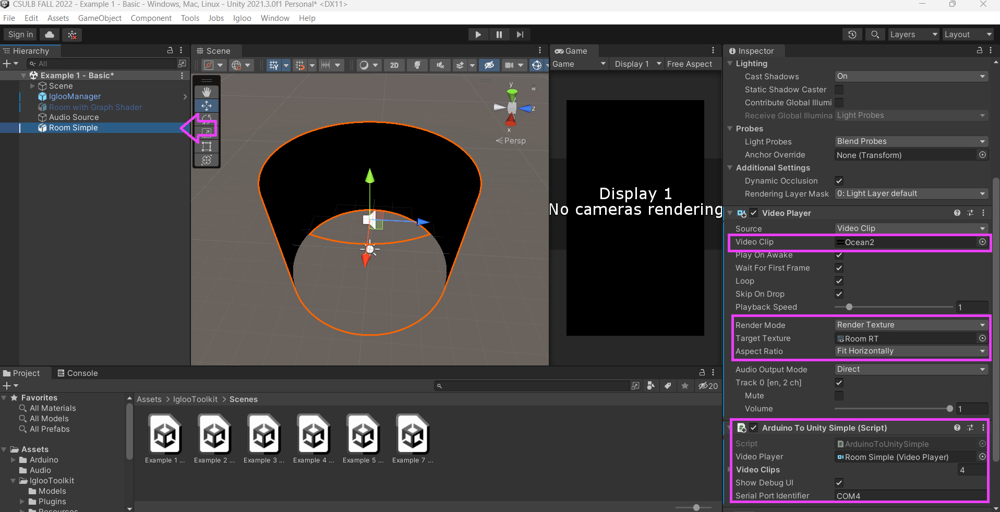
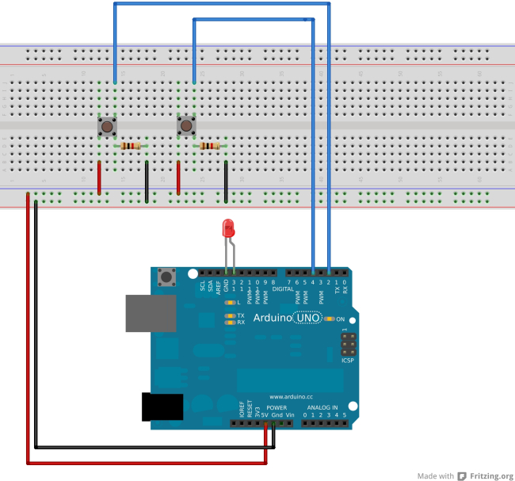
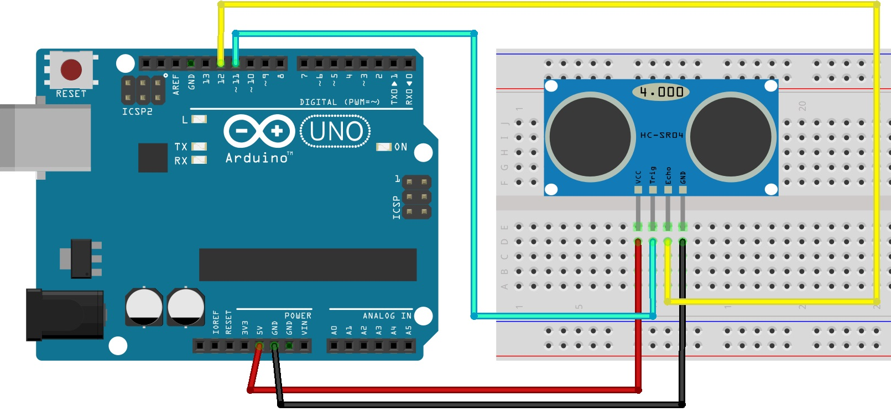
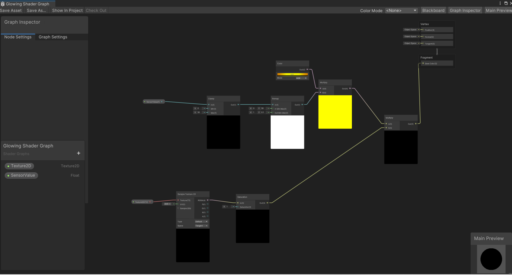

**360 ROOM, CSULB, UNITY SETUP**

This project aims to help my students at CSULB for setting up content for Igloo 360 Room:

- Download the entire package
- use "Unreal-Unity-DocsAndToolkit(1).zip" and "Unity Game Engine Camera System" to install all requirements for installing Igloo Toolkit in your Unity
- Prepare your videos: Video size: 8000 x 1000 (Quicktime .MOV)
- Using Unity Hub open "CSULB Fall 2022"
- The main scenes is under "Scenes"> "Example1". 

Please note that you have three different setup options here (you can enable each option and use it in your project):

**1. "Room Simple" will respond to buttons inputs:**
-  you have to select ""Room Simple" on the Hierarchy menu and click diplay on inspector (turn "Room with Graph Shader off")
-  room has a basic render texture (material) using Universal Render Pipelinie.
-  video content responds to Arduino input (pressing two buttons make videos to change). 
-  note: Select "Room Simple" in Unity and go to "inspector"> "Arduino to Unity Simple (Script)": you have to change the "serial port- ame". eg. "COM6" to your port number.
-  note: Select "Room Simple" > "inspector" > "Video Player": you will also need to add four videos under video clips. 
    
   -  button 1 button 2
   -     [0]       [0]
   -     [1]       [1]
   -     [0]       [1]
   -     [1]       [0] 
       Four different combinations of buttons could activat different videos 
- In case you like to learn about displaying video in a surface in Unity using Render Texture, you can watch this tutorial: https://www.youtube.com/watch?v=KG2aq_CY7pU&ab_channel=Unity
- For wiring and explanation of ultrasonic sensor you can read this: https://randomnerdtutorials.com/complete-guide-for-ultrasonic-sensor-hc-sr04/

**2. "Room with Graph Shader":**
- you have to select "Room with Graph Shader" on the Hierarchy menu and click diplay on inspector (turn "Room Simple off")
- This room has a basic graph shader with a glowing effect which respond to ultrasonic sensor value (distance). 
- Shader Graph has two inputs: Texture2D which is our "Room RT" (Render Texture) and "Sensor Value" which comes from our sensor. Sensor value has been clamped and remaped in order to manipulate the color of fragment shador.

- Please note for Graph Shaders to be working you need to install Universal Render Pipeline. Here is a basic tutorial on Graph Shaders: https://www.youtube.com/watch?v=Ar9eIn4z6XE
- Here is the instruction on how to install the Universal Render Pipeline into an existing Project: https://docs.unity3d.com/Packages/com.unity.render-pipelines.universal@7.1/manual/InstallURPIntoAProject.html

